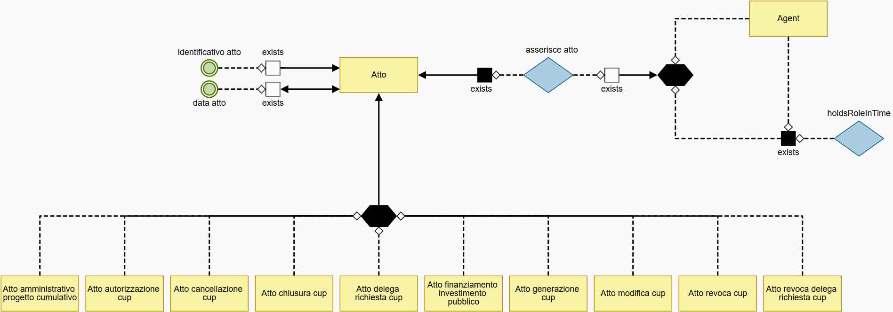
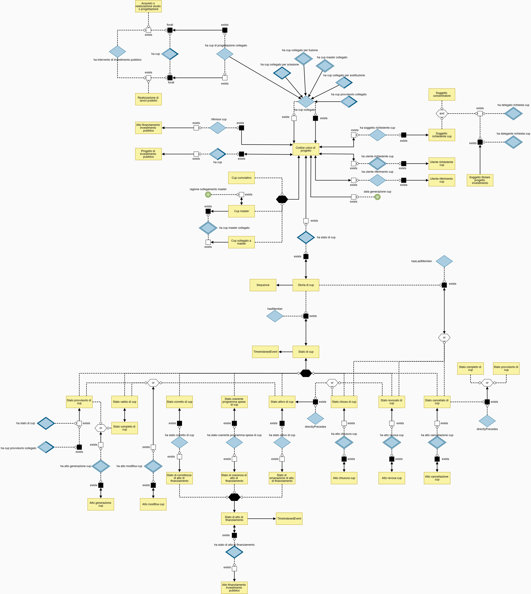
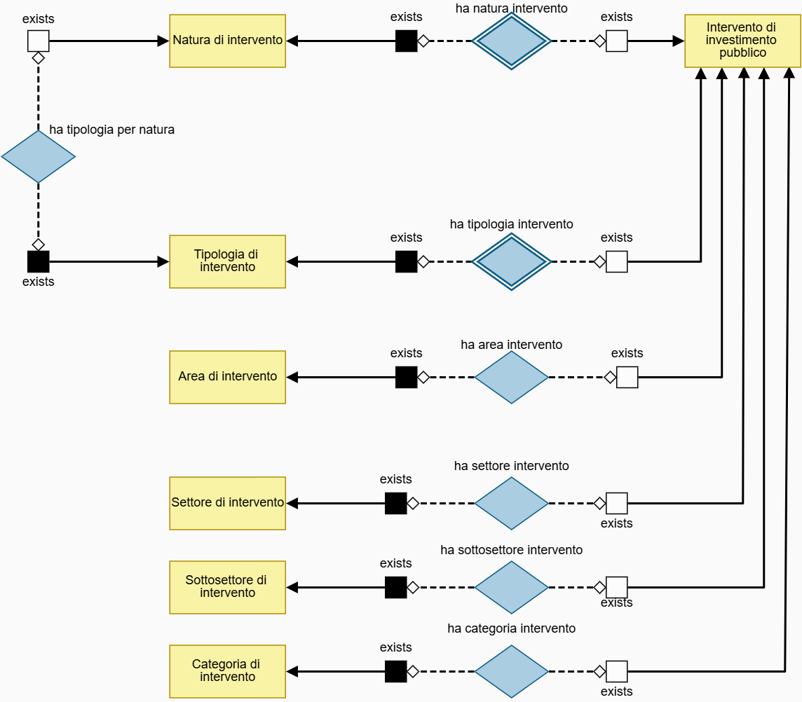
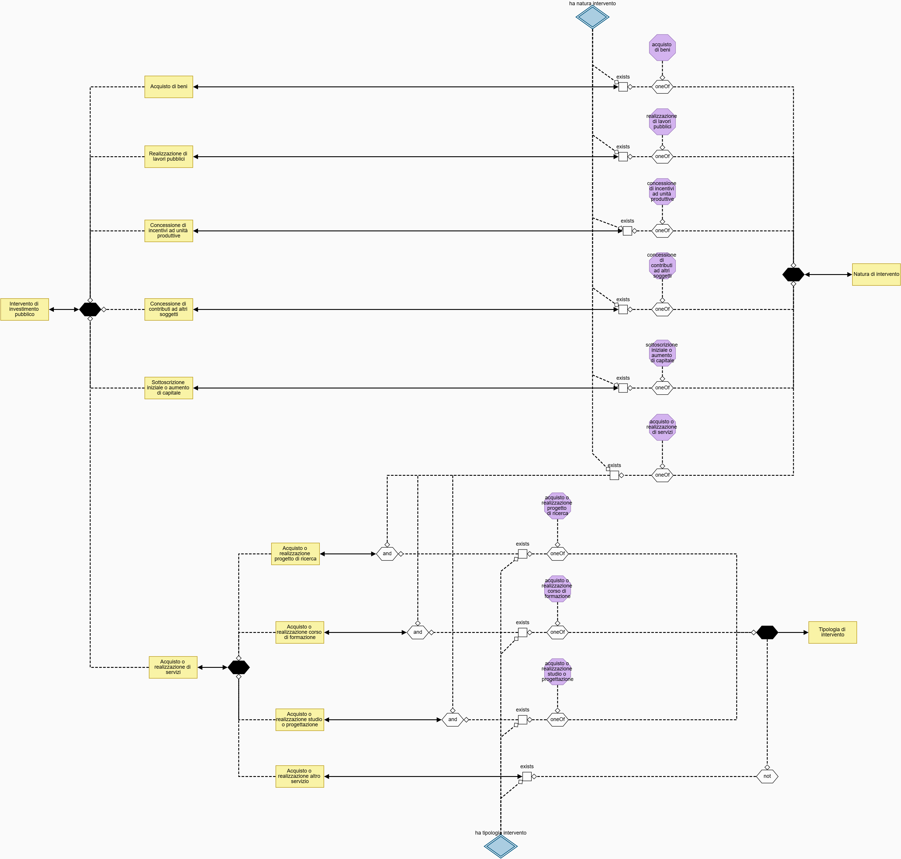
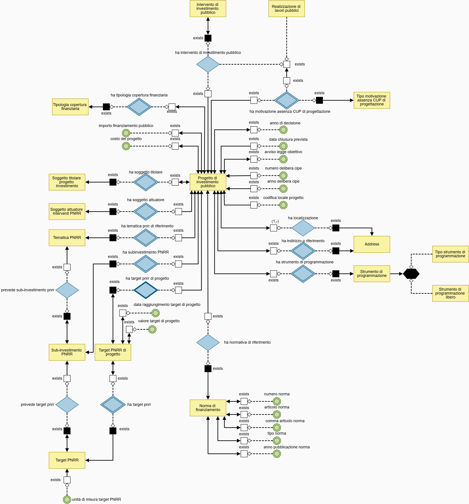
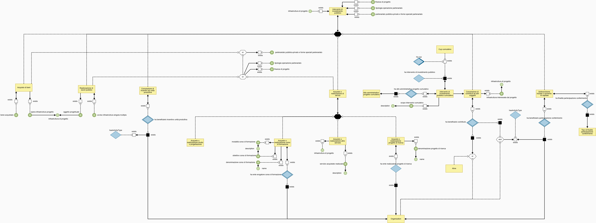
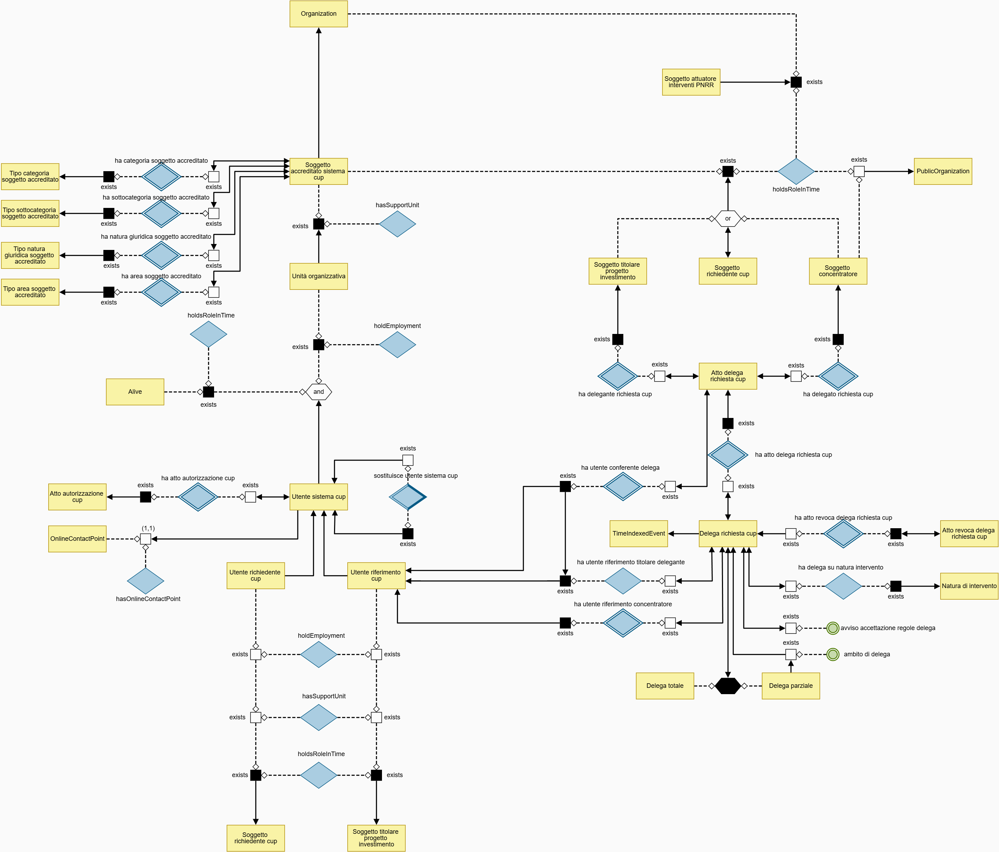

# OpenCUP  ontology
The ontology is formally written in OWL2 and includes constraints, axioms, and annotations; it was developed by experienced engineers and validated by domain specialists.
It is a development environment completely managed by istat.
This expert-driven ontology plays a crucial role in the experimental process: it is used as a validation reference to compare the knowledge graphs automatically generated by LLMs, enabling a systematic evaluation of how closely the automatically generated ontological structures match those manually constructed, as well as whether additional concepts are introduced beyond the expert-defined ontology from the same documentary basis.

It is formalized in OWL2.

It is divided into specific areas:
1. Atto:

2. CUP:

3. Intervento

4. Natura dell'intervento

5. Progetto d’investimento pubblico

6. Relazioni dell'intervento

7. Soggetto

